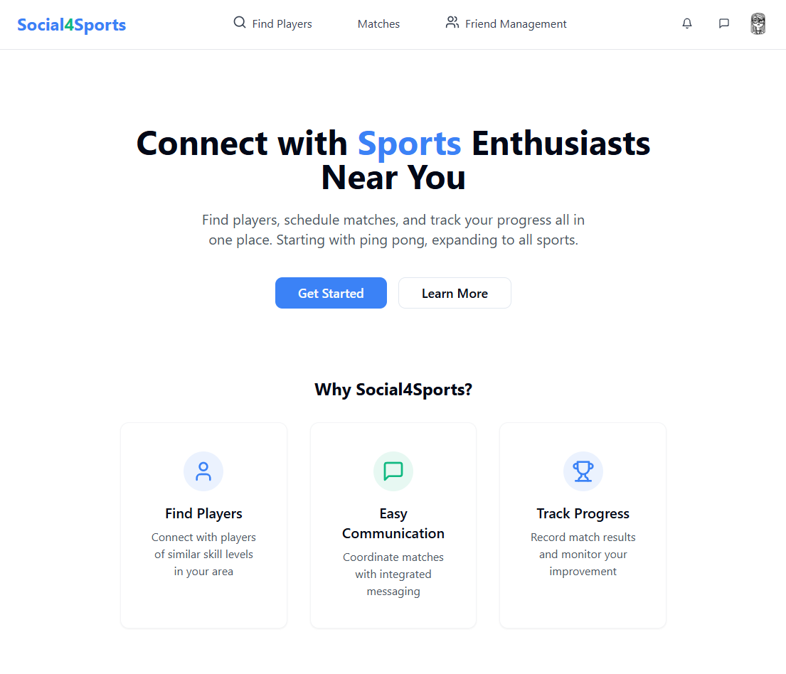
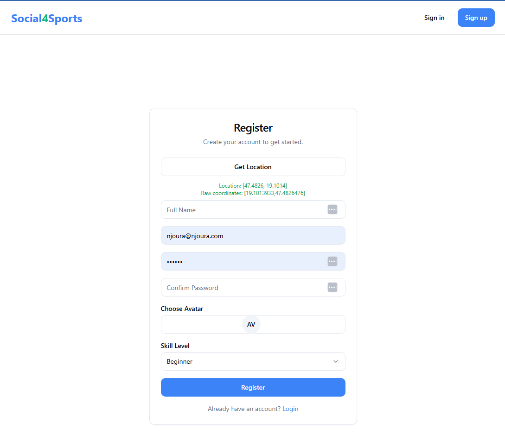
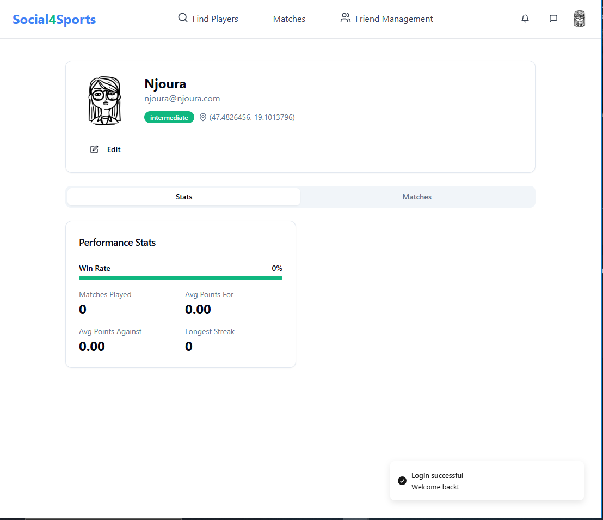
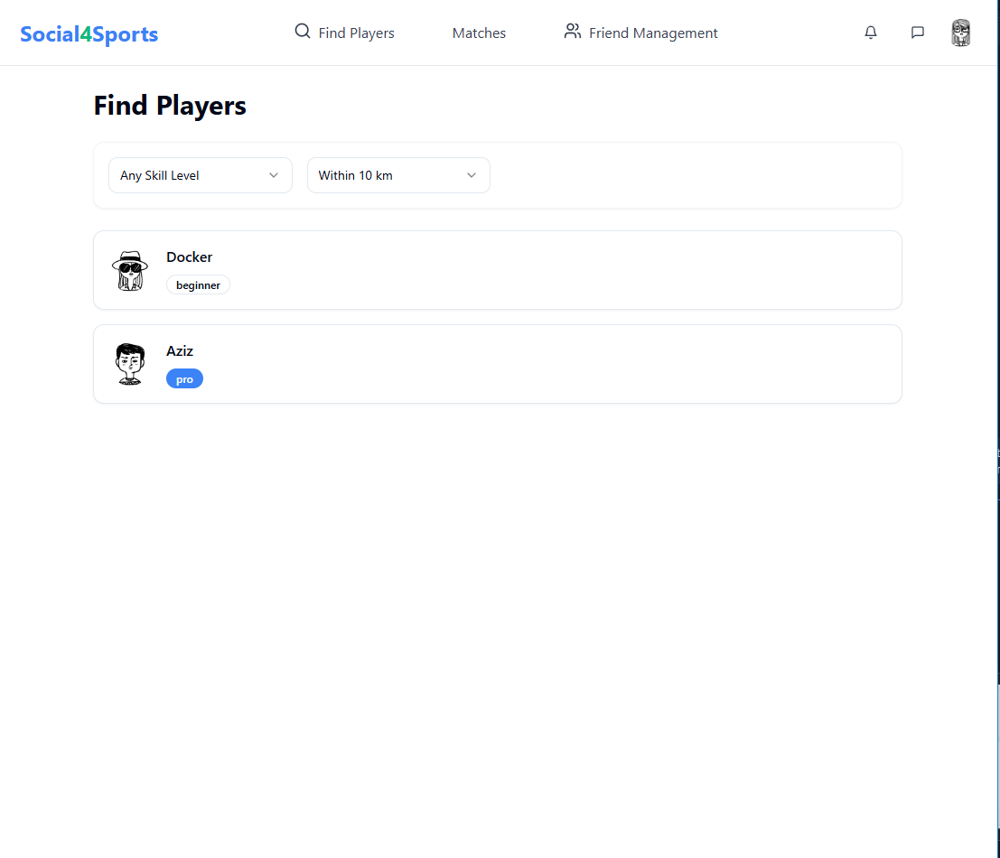
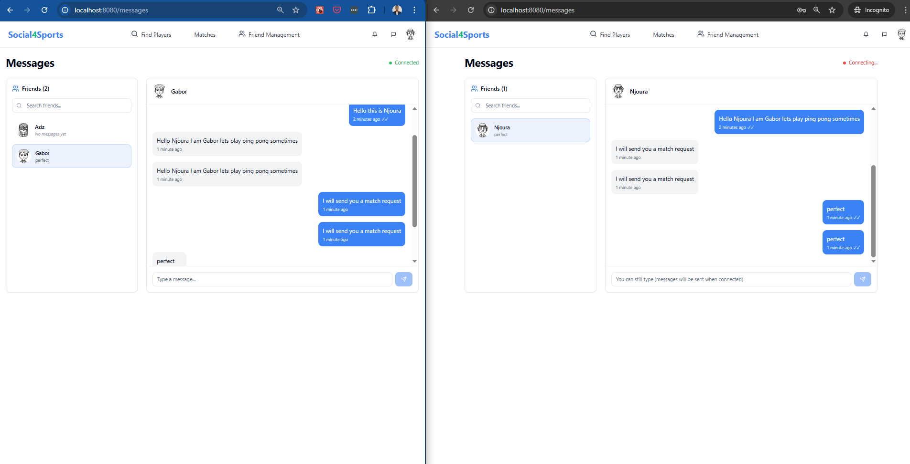
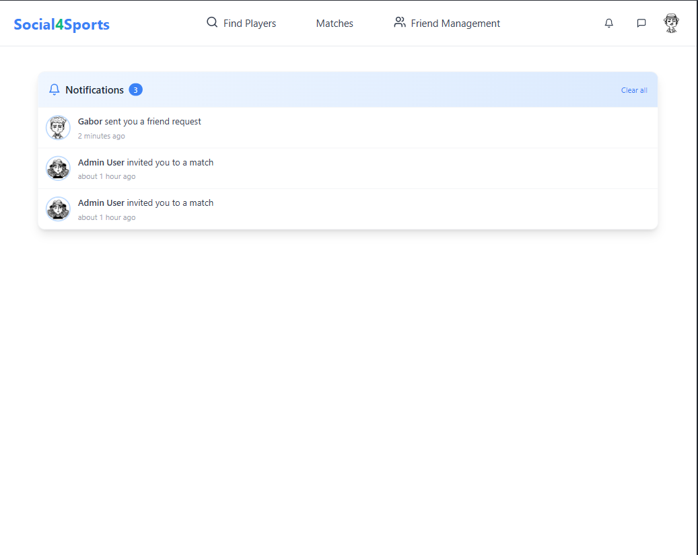
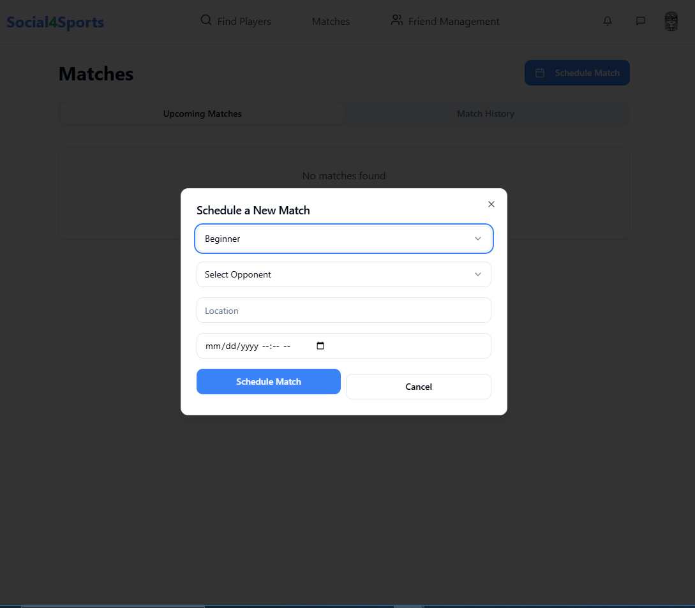

# Social4Sports: Connect Through Sports  

🏓 Modern platform connecting ping pong players to find matches, track progress, and chat in real-time.  

  

## 🚀 Quick Start  

### Prerequisites  
- Node.js (v16+)  
- Running backend API (default: `http://localhost:8000`)  

### Installation  
```bash
git clone https://github.com/yourusername/social4sports.git  
cd social4sports  
npm install
```

Environment Setup
Create .env file in root directory:

env
```VITE_API_URL=http://localhost:8000  
VITE_API_SOCKET_PATH=http://localhost:3000
```
Run Development Server

```bash
npm run dev  
Access at: http://localhost:8080
```

### ✨ Key Features
- Authentication with jwt


---

- Profile stats


---

- Player Discovery
📍 Find nearby players by skill level/availability


---

- Real-Time Messaging
💬 Chat and schedule matches instantly


---

- notification system
  

---

- Match Management
📅 Schedule games & track history
📊 View performance analytics


---



🛠️ Technology Stack
Area	Technologies
- Frontend	React, TypeScript, Vite
- Styling	Tailwind CSS, ShadCN UI
- State	Context API, Zustand, axios
- Backend	Node.js API (separate repo)

### 🌟 Future Roadmap
- 🎾 Multi-sport expansion

- 🏆 Tournament mode

- 📱 Mobile app development

- 🤖 Smart matchmaking algorithm

### 👥 Team
Aziz Najjar - Laouissi Sadok - Ali Husnain - Daemi Mahsa


Developed with ❤️ by Social4Sports Team @ ELTE
