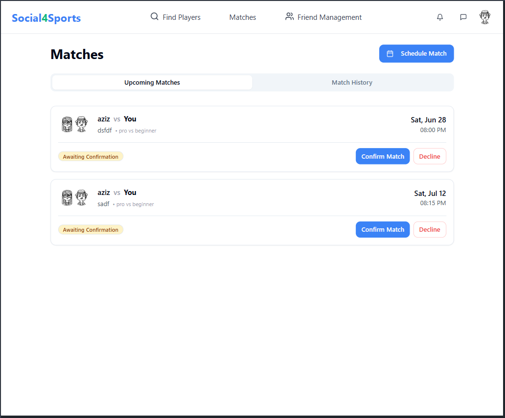

# Social4Sports: Connect Through Sports  

🏓 Modern platform connecting ping pong players to find matches, track progress, and chat in real-time.  

  

## 🚀 Quick Start  

### Prerequisites  
- Node.js (v16+)  
- Running backend API (default: `http://localhost:8000`)  

### Installation  
```bash
git clone https://github.com/yourusername/social4sports.git  
cd social4sports  
npm install
```

Environment Setup
Create .env file in root directory:

env
```VITE_API_URL=http://localhost:8000  
VITE_API_SOCKET_PATH=http://localhost:3000
```
Run Development Server

```bash
npm run dev  
Access at: http://localhost:8080
```

## ✨ Key Features

### 🔐 Authentication  
- Secure JWT login system  


---

### 📊 Player Profiles  
- Detailed stats and match history  


---

### 🔍 Player Discovery  
📍 Find nearby players by skill level/availability  


---

### 💬 Real-Time Messaging  
- Instant chat with opponents  
- Schedule matches directly  


---

### 🔔 Notification System  
- Get alerts for new messages and match updates  


---

### 🏓 Match Management  
📅 Schedule games & track history  
📊 Performance analytics dashboard  

<div style="display: flex; gap: 20px; margin-top: 15px;">
  
  
</div>

🛠️ Technology Stack
Area	Technologies
- Frontend	React, TypeScript, Vite
- Styling	Tailwind CSS, ShadCN UI
- State	Context API, Zustand, axios
- Backend	Node.js API (separate repo)

### 🌟 Future Roadmap
- 🎾 Multi-sport expansion

- 🏆 Tournament mode

- 📱 Mobile app development

- 🤖 Smart matchmaking algorithm

### 👥 Team
Aziz Najjar - Laouissi Sadok - Ali Husnain - Daemi Mahsa


Developed with ❤️ by Social4Sports Team @ ELTE
